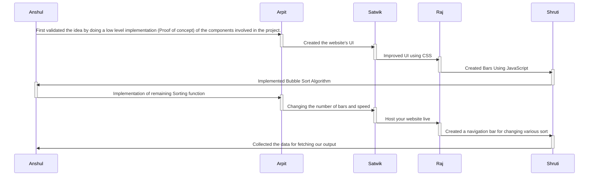

# Sorting Visualizer

Welcome to Sorting Visualizer! I built this application because I was fascinated by sorting algorithms, and I wanted to visualize them in action. I hope that you enjoy playing around with this visualization tool just as much as I enjoyed building it. You can access it here (use Google Chrome!): https://clementmihailescu.github.io/Sorting-Visualizer/
Here's a simple flow chart:

